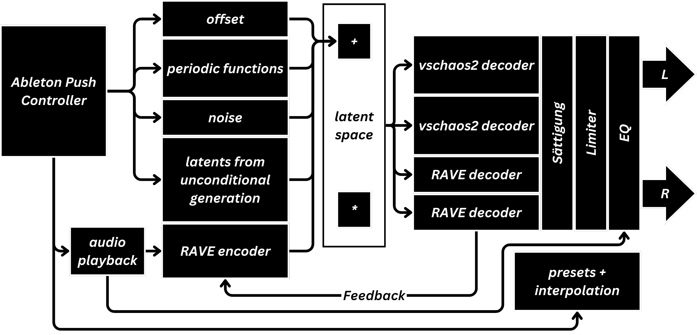
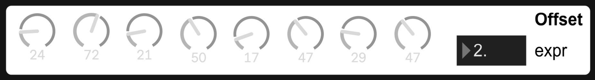
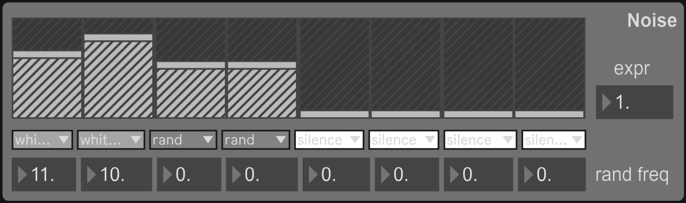
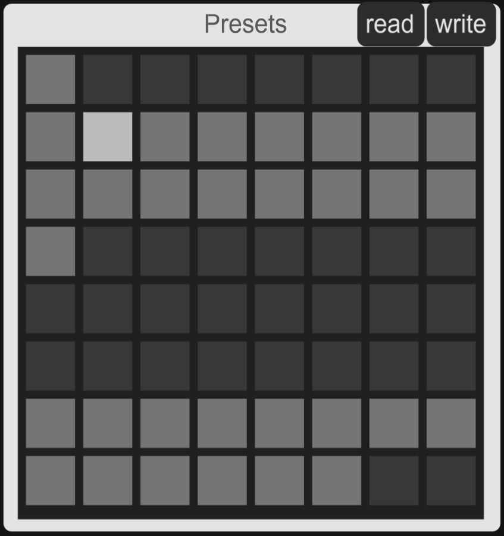

# Neural Audio Synthesizer

A Max/MSP-based neural audio instrument that turns latent spaces into a playable synthesizer.

This project builds on previously trained **RAVE** and **vschaos2** neural audio models and uses the `nn~` external in Max/MSP to turn them into an interactive performance instrument. It focuses on **latent manipulation**, **timbre transfer**, and **(quasi) unconditional generation**.

> ⚠️ This is a prototype / research instrument. It is CPU-heavy and tuned to specific models; it is not a polished commercial device.

---

## Core Idea

The Neural Audio Synthesizer uses **four neural decoders** as its sound engine:

- 2 × RAVE decoders  
- 2 × vschaos2 decoders  

Each decoder:

- Receives an 8-dimensional latent control signal  
- Outputs a **mono** audio signal  
- Can be activated/deactivated, level-balanced and panned via:
  - the Max/MSP GUI, or  
  - an **Ableton Push** controller (via a modified `jk.push 2` package by Jeff Kaiser)

Two decoders per model, driven by the **same** latent input, produce slightly different reconstructions. Together with Max’s scheduler timing, this creates a subtle stereo and micro-timing spread.

The mixed stereo output is then processed through a small VST master chain:

1. **Compressor** – soft saturation / rounding of the lo-fi decoder aesthetic  
2. **Limiter** – protection against extreme peaks  
3. **EQ** – taming over-represented frequency bands in the decoder output  

---

## High-Level Architecture

Signal flow (simplified):

1. **Latent Manipulation Modules** (8-channel each)
   - Offset
   - Oscillators
   - Noise & Random
   - Presets & Interpolations
   - Encoder Inputs
   - Latent Code Jamming

2. All latent modules are **summed** (per latent channel) into an 8-channel latent vector.

3. The latent vector is sent to each of the four `nn~` decoder objects:
   - 2 × RAVE decoders
   - 2 × vschaos2 decoders

4. The four mono decoder outputs are:
   - level-balanced
   - panned for stereo
   - mixed to a stereo bus

5. The stereo bus passes through:
   - compressor → limiter → EQ → audio output

---

## Requirements

- **Max/MSP** (8.x or later recommended)
- **nn~ external**  
  A neural network external for Max/MSP used to host the RAVE / vschaos2 decoders.
- **Pretrained models**
  - RAVE decoder models
  - vschaos2 decoder models  
  (Not included here; the patch is designed to work with these specific models.)
- **Ableton Push** (optional, but highly recommended)
  - Integration via a **modified** `jk.push 2` Max package by Jeff Kaiser.
- **A powerful CPU**
  - 4 parallel `nn~` objects stress the CPU heavily.
  - In tests, an Intel i7 @ 2.6 GHz still produced dropouts with all 4 decoders active.
- **High audio buffer settings in Max**
  - Example: I/O Vector Size = 2048, Signal Vector Size = 2048  
  - This improves stability at the cost of high latency (live input becomes impractical).

---

## Latent Manipulation Modules

All latent modules work in **8 channels**, matching the 8 latent inputs of each decoder. Where possible, Max’s multichannel MSP objects are used.

### 1. Offset

Generates 8 constant control signals:

- Each channel has its own offset value (set via GUI or Ableton Push knobs).
- A global **expression multiplier** (touch strip on Push) scales all 8 channels at once.
- Using only the Offset module results in **static sound textures** whose timbre is shaped by the latent parameters.

### 2. Oscillators

Generates 8 independent periodic signals:

- Per channel, you can choose between:
  - `cycle~` (sine)
  - `saw~`
  - `rect~`
  - `tri~`
- Parameters per channel (via GUI / Push):
  - Frequency
  - Amplitude
  - Pulse width (where applicable)
- A global or per-channel expression multiplier (Touch Strip) modulates amplitudes.
- Using only the Oscillators module produces **periodic phrases** whose character strongly depends on waveform and settings.

### 3. Noise & Random

Generates 8 independent random/chaotic signals:

- Based on `noise~` / `rand~` in MSP.
- Output is scaled by an expression multiplier.
- Alone, this module produces **non-repetitive but internally consistent textures**.

### 4. Presets & Interpolations

All settings from Offset, Oscillators, and Noise modules can be **stored and recalled**:

- Built using Max’s `preset` / `pattrstorage` system.
- Up to 64 presets can be accessed via:
  - a dedicated **preset sub-menu** on Ableton Push (touchpad triggering)
  - a double footswitch to move to previous / next preset

Two ways of moving between presets:

- **Hard switch** – instant jump to new parameters  
- **Interpolation** – parameters smoothly morph between presets:
  - by setting an interpolation time, or
  - via a manual interpolation control (e.g. a knob)

### 5. Encoder Inputs (Timbre Transfer & Feedback)

External audio sources can be fed into a **RAVE encoder**, then routed back to the decoders:

- Inputs can be:
  - pre-recorded audio files → **timbre transfer**
  - outputs of the RAVE decoder → feedback loops
  - outputs of vschaos2 → cross-feedback  
  - (Live audio was prototyped but dropped due to too high latency.)

The encoder:

- Compresses the audio into latent space.  
- The latent code is scaled by an expression multiplier and routed selectively:
  - to chosen decoders
  - to specific latent dimensions (e.g. only certain latent channels respond)

This allows, for example, **targeted excitation of resonances** in selected latent dimensions.

### 6. Latent Code Jamming

Inspired by Martin Heinze’s “Saatgut Proxy” (a Pure Data patch for stochastic latent sequences):

- Random latent codes are generated and stored in a buffer.
- Replaying the buffer into the decoder yields **repeatable patterns** that can be:
  - edited in real time
  - looped
  - time-stretched / compressed

Extension in this project:

- Instead of purely random codes, latent codes are derived from **samples generated by a RAVE Latent Diffusion model** (unconditional generation).
- Due to technical limitations during the project:
  - Generated samples could *not* be stored directly as latent numpy arrays.
  - Instead, audio had to be re-encoded through RAVE (encoder + decoder), which adds an extra compression step and some quality loss.
- A future improvement would be:
  - Directly saving generated latent codes as numpy arrays and loading them into Max/MSP (e.g. `buffer~`), avoiding unnecessary re-encoding.

---

## Practical Notes & Limitations

- **CPU load is high** with four decoders; expect fans and possible dropouts on weaker machines.
- To avoid dropouts, the patch uses **large vector sizes** (2048 samples), which leads to:
  - high latency for real-time input,
  - but acceptable behavior for internal generation / performance.
- The implementation is tuned to specific **RAVE** and **vschaos2** models; using different models may require:
  - retraining / retuning latent ranges
  - adjusting gain staging and EQ.

---

## Getting Started (Conceptual)

1. Install Max/MSP and the `nn~` external.
2. Install or link the **RAVE** and **vschaos2** models expected by the patch.
3. Install the (modified) `jk.push 2` package if you want Ableton Push integration.
4. Open the main patcher (e.g. `NeuralAudioSynthesizer.maxpat`) from this repo.
5. Configure your audio settings:
   - High vector sizes (e.g. 2048) to reduce dropouts.
   - Proper output device and sample rate.
6. Start with:
   - Only one decoder active.
   - Offset module only.
   - Slowly explore oscillator, noise, presets and encoder inputs.
7. Add more decoders and modules as your CPU allows.

---

## License / Credits

- Max/MSP patches and glue code in this repo – © the author (see LICENSE if provided).
- **nn~ external** – by its respective authors.
- **jk.push 2** – by Jeff Kaiser (modified for this project).
- **RAVE** and **vschaos2** – neural audio models by their respective creators.
- **Latent Code Jamming** module conceptually inspired by Martin Heinze’s “Saatgut Proxy”.

If you use, fork, or extend this work, please credit:

> *Neural Audio Synthesizer (Max/MSP instrument based on RAVE and vschaos2 models)*

and the original model / tool authors where appropriate.

---
